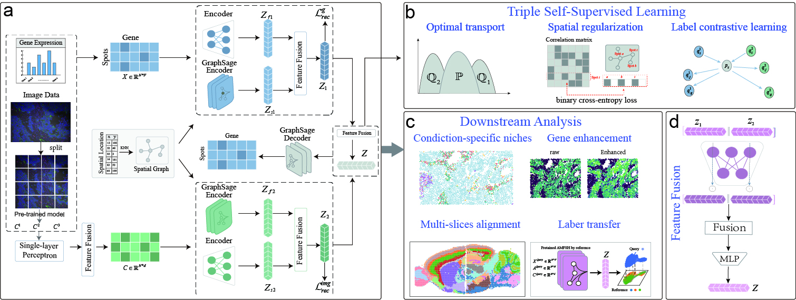

# SYMOL

Accurate Delineation of Cellular Niches via Integrated Spatial Transcriptomics and Histological Imaging with SYMOL

## SYMOL Model

Spatial transcriptomics enables fine-scale characterization of spatial heterogeneity and cellular niches within tissues and has substantially advanced our understanding of tissue architecture and functional organization. However, existing spatial transcriptomics integration methods often struggle to effectively capture the rich morphological information provided by the histology and thus further limiting their capacity for comprehensive cross-modality learning. In this paper, we present SYMOL, a unified synergistic self-supervised multimodal framework that integrates spatial coordinates, gene expression, and histological images covering both multichannel immunohistochemistry (IHC) and hematoxylin and eosin (H&E) stains for effective spatial transcriptomics integration and representation learning. Specifically, SYMOL extracts distinct visual characteristics via several pretrained large vision models and synergistically aggregates cross-modal features into unified morphology-aware embeddings. Comprehensive benchmarking on multiple publicly available spatial transcriptomics datasets with multichannel IHC images and H&E images shows that SYMOL consistently surpasses state-of-the-art methods in various downstream tasks including cellular niche identification, multi-slice integration, cross-dataset label transfer, and gene-expression enhancement. In addition, SYMOL accurately delineates tumor microenvironment in lung tissues with histopathological imaging and enables fine-scale mapping of cellular niches in the mouse brain, thereby demonstrating both clinical relevance and robustness in complex neuroanatomical settings.
## Requirements

The following package is required to run proust:

python==3.10
torch==1.13.0+cu117
numpy==1.26.2
tqdm==4.67.1
scanpy==1.9.4
scipy==1.12.0
opencv-python==4.8.1.78
scikit-learn==1.5.2
rpy2==3.5.2

## Tutorial
Please refer to this tutorial for the step-by-step demonstration on the Human Breast Cancer dataset.
